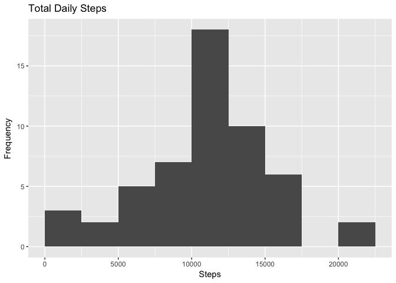
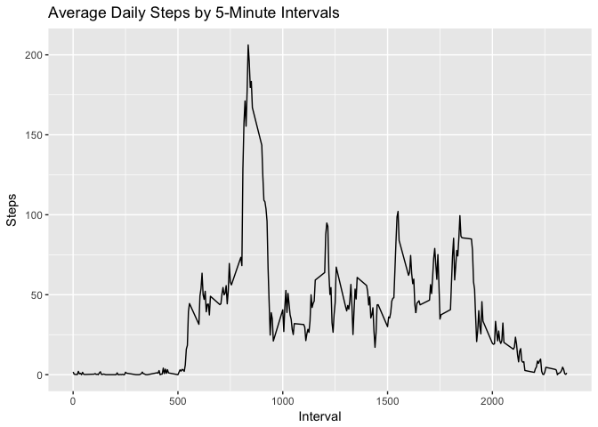
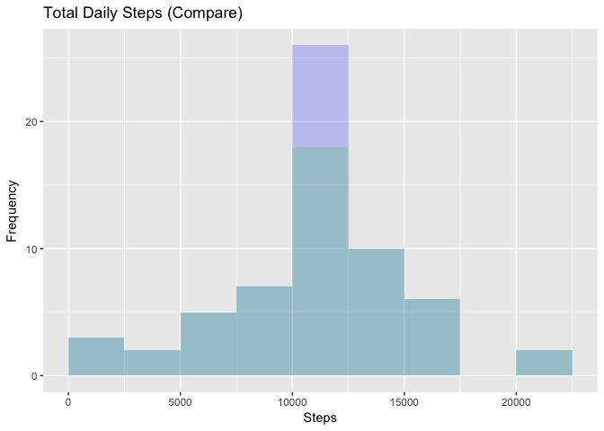
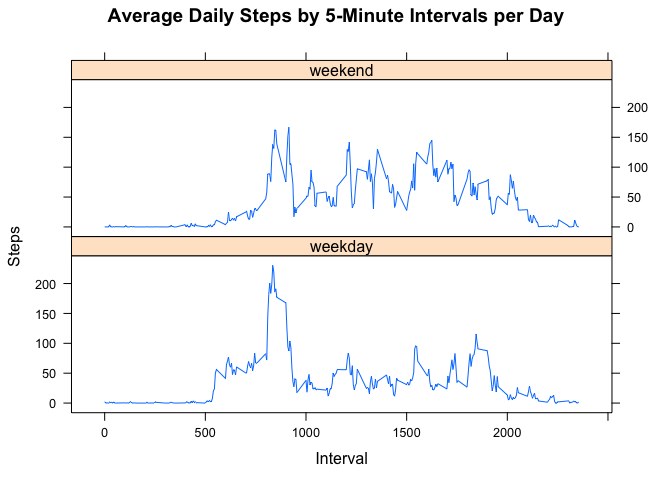

# Reproducible Research: Peer Assessment 1
Matthew Orr  
03/13/2017  
#About

This project was done as part of *Johns Hopkins University*'s *Data Science Specialization* offered on *Coursera.org*.

##Libraries

The following libraries were used for this project:

```r
library(ggplot2)
library(lattice)
library(dplyr)
```

```
## 
## Attaching package: 'dplyr'
```

```
## The following objects are masked from 'package:stats':
## 
##     filter, lag
```

```
## The following objects are masked from 'package:base':
## 
##     intersect, setdiff, setequal, union
```

## Loading and preprocessing the data

Code for reading in the dataset and/or processing the data:

```r
temp <- tempfile()
download.file("https://d396qusza40orc.cloudfront.net/repdata%2Fdata%2Factivity.zip",
  temp, method = "curl")
dateDownloaded <- date()
activity <- unzip(temp)
unlink(temp)
activity <- read.csv(activity)
```

## What is mean total number of steps taken per day?

Histogram of the total number of steps taken each day:

```r
activity_byDate <- aggregate(steps~date, activity, sum)
ggplot(activity_byDate, aes(steps)) + geom_histogram(binwidth = 2500, 
  boundary = 2500) + labs(x = "Steps", y = "Frequency", title = "Total Daily Steps")
```

<!-- -->

Mean and median number of steps taken each day:

```r
meanSteps <- mean(activity_byDate$steps)
medianSteps <- median(activity_byDate$steps)
```
The mean number of steps taken each day is `meanSteps`.
The median number of steps taken each day is `medianSteps`.

## What is the average daily activity pattern?
Time series plot of the average number of steps taken:

```r
activity_byInterval <- aggregate(steps~interval, activity, mean)
ggplot(activity_byInterval, aes(interval, steps)) + geom_line() + labs(
  x = "Interval", y = "Steps", title = "Average Daily Steps by 5-Minute Intervals")
```

<!-- -->

The 5-minute interval that, on average, contains the maximum number of steps:

```r
maxSteps <- max(activity_byInterval$steps)
interval_maxSteps <- activity_byInterval[activity_byInterval$steps==maxSteps,1]
```

The maximum number of steps is `maxSteps` which occured on the `interval_maxSteps`th interval.


## Imputing missing values

Code to describe and show a strategy for imputing missing data:
I plugged in average numbers from the previous activity_byInterval chart.


```r
qty_missingValues <- nrow(activity[is.na(activity$steps),])
activity_complete <- activity
for(i in 1:nrow(activity_complete)) {
  if(is.na(activity_complete$steps[i]) == TRUE){
    activity_complete$steps[i] <- 
      round(activity_byInterval[activity_byInterval$interval == 
      activity_complete$interval[i],2])
  }
}
activity_byDate_complete <- aggregate(steps~date, activity_complete, sum)
```

Histogram of the total number of steps taken each day after missing values are imputed

```r
ggplot(NULL, aes(steps)) + 
  geom_histogram(data=activity_byDate, binwidth = 2500, boundary = 2500, 
  position = "stack", fill = "green", alpha = 0.2) + 
  geom_histogram(data=activity_byDate_complete, binwidth = 2500, boundary = 2500,
  position = "stack", fill = "blue", alpha = 0.2) +
  labs(x = "Steps", y = "Frequency", title = "Total Daily Steps (Compare)")
```

<!-- -->


```r
meanSteps_complete <- mean(activity_byDate_complete$steps)
medianSteps_complete <- median(activity_byDate_complete$steps)
```

After adding the missing values:
-The mean number of steps taken each day is `meanSteps_complete`.
-The median number of steps taken each day is `medianSteps_complete`.

## Are there differences in activity patterns between weekdays and weekends?

Panel plot comparing the average number of steps taken per 5-minute interval across weekdays and weekends:

```r
activity_complete$date <- as.Date(activity_complete$date)
activity_complete$day <- weekdays(activity_complete$date)
activity_complete$dayOfWeek <- as.factor(ifelse(
  activity_complete$day == "Saturday" | activity_complete$day == "Sunday",
  "weekend", "weekday"))
activity_byDayOfWeek <- activity_complete%>%group_by(interval, dayOfWeek)%>%summarize(steps = mean(steps, na.rm=TRUE))
xyplot(activity_byDayOfWeek$steps ~ activity_byDayOfWeek$interval|activity_byDayOfWeek$dayOfWeek, 
  main="Average Daily Steps by 5-Minute Intervals per Day",xlab="Interval", ylab="Steps",layout=c(1,2), type="l")
```

<!-- -->
